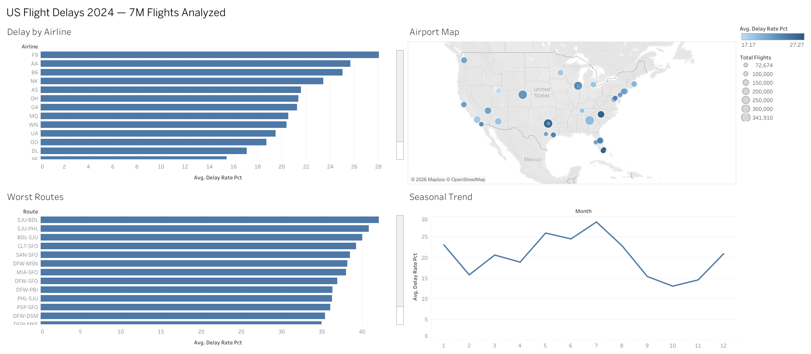

# ✈️ Flight Delay Analytics

An end-to-end data pipeline analyzing **7M+ US domestic flights** from 2024, taking raw government data through cloud warehousing to an interactive dashboard. Built to explore what drives flight delays across carriers, routes, airports, and seasons.

**📊 [View the live dashboard on Tableau Public →](https://public.tableau.com/app/profile/husnain.abbas7784/viz/USFlightDelays2024/Dashboard1)**

---

## Overview

This project ingests the full year of **Bureau of Transportation Statistics (BTS) On-Time Performance** data, cleans and validates it, loads it into **Google BigQuery**, and visualizes delay patterns in **Tableau**.

- **7,079,081 flights** analyzed (full 2024)
- **20.5%** overall delay rate (departures delayed >15 min)
- Delay patterns broken down by carrier, route, origin airport, month, and day of week

## Architecture

**Raw BTS CSVs → Python ETL (pandas) → Parquet → Google BigQuery → SQL aggregation → Tableau Public**

## Pipeline

**`src/01_clean.py`** — Reads the raw BTS On-Time Performance files, standardizes columns, engineers features (delay flags, route strings, day-of-week, delay buckets), and writes a validated Parquet file. Cleaning follows explicit leakage discipline: fields only knowable *after* a flight completes are handled carefully so they can't leak into delay definitions.

**`src/02_load_bigquery.py`** — Loads the cleaned Parquet into a BigQuery table using a service-account credential, making the full 7M-row dataset queryable in the cloud.

## SQL

All dashboard views are powered by aggregation queries run against the 7M-row BigQuery table. Each query lives in [`sql/`](sql/) and exports one CSV to `data/tableau/`:

| Query | Feeds |
|---|---|
| [`delay_by_airline.sql`](sql/delay_by_airline.sql) | Carrier delay-rate ranking |
| [`delay_by_month.sql`](sql/delay_by_month.sql) | Seasonal trend line |
| [`delay_by_dow.sql`](sql/delay_by_dow.sql) | Day-of-week comparison |
| [`delay_by_airport.sql`](sql/delay_by_airport.sql) | Airport map (top 30 by traffic) |
| [`worst_routes.sql`](sql/worst_routes.sql) | Worst origin→destination routes |
| [`delay_heatmap_dow_month.sql`](sql/delay_heatmap_dow_month.sql) | Day-of-week × month heatmap |

## Dashboard

The [Tableau Public dashboard](https://public.tableau.com/app/profile/husnain.abbas7784/viz/USFlightDelays2024/Dashboard1) includes:

- **Seasonal Trend** — monthly delay rate across the year (clear summer peak)
- **Delay by Airline** — carriers ranked worst-to-best by delay rate
- **Worst Routes** — the 15 origin→destination pairs with the highest delay rates
- **Airport Map** — US airports plotted geographically, sized by traffic and colored by delay rate

## Tech Stack

`Python` · `pandas` · `Google BigQuery` · `SQL` · `Tableau`

## Data Source

[BTS On-Time Performance data](https://www.transtats.bts.gov/) — U.S. Department of Transportation, Bureau of Transportation Statistics (2024).

## Running It Yourself

The raw data and cleaned Parquet are excluded from the repo (large / regenerable). To reproduce:

1. Download 2024 On-Time Performance data from BTS
2. `python src/01_clean.py` — produces the cleaned Parquet
3. Add your BigQuery `credentials.json`, then `python src/02_load_bigquery.py` — loads to BigQuery
4. Run the queries in `sql/` against your BigQuery table and export the results to `data/tableau/`