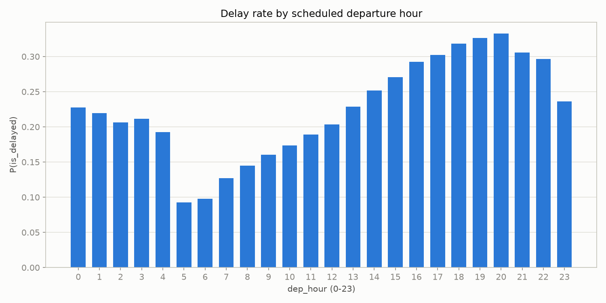
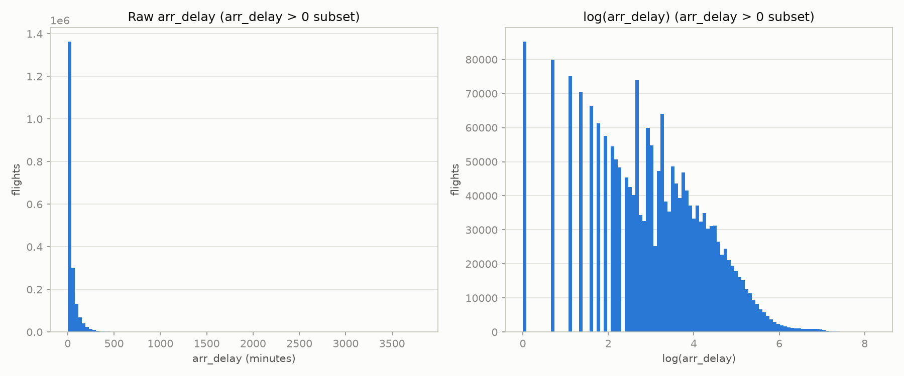
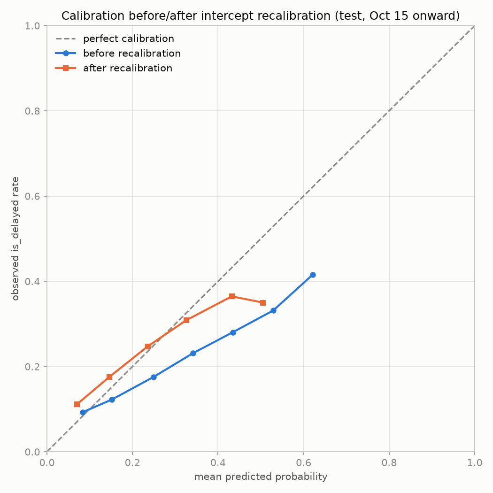
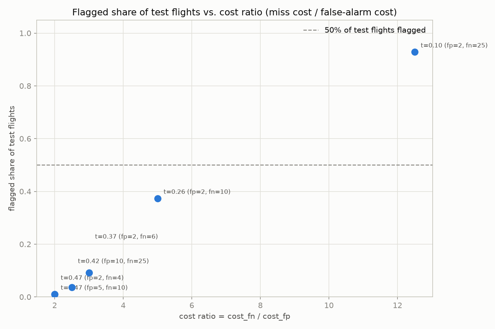

# ✈️ Flight Delay Analytics

An end-to-end look at **7,079,081 US domestic flights** from 2024: I take raw government data through cloud warehousing to an interactive dashboard, then use the same dataset to answer two regression questions about *why* flights are late and whether lateness can be predicted before a flight even happens.

**📊 [View the live dashboard on Tableau Public →](https://public.tableau.com/app/profile/husnain.abbas7784/viz/USFlightDelays2024/Dashboard1)**

[](https://public.tableau.com/app/profile/husnain.abbas7784/viz/USFlightDelays2024/Dashboard1)

---

## Summary

I ingested the full year of **Bureau of Transportation Statistics (BTS) On-Time Performance** data — 7,079,081 flights — cleaned it, loaded it into BigQuery, and built a Tableau dashboard exploring delay patterns by carrier, route, airport, and season. That's the ETL half of this project. The second half uses the same cleaned dataset to answer two specific questions with regression models: what drives *how late* a delayed flight runs, and whether a flight can be flagged as delay-risk *before* it departs, using only information a passenger has at booking time.

## The two questions

These read like the same problem but they aren't — they're different jobs with different rules about which features are allowed and which metrics matter:

- **"Among flights that arrive late, what drives how late they are?"** — an **inference** problem. I fit OLS on `log(arrival delay)` restricted to flights that actually ran late, and I care about *which coefficients are real* (robust standard errors, confidence intervals), not just predictive accuracy.
- **"At booking time, can I flag flights likely to arrive 15+ minutes late?"** — a **prediction** problem. I fit logistic regression using only features a passenger knows when buying a ticket (airline, route, scheduled time, day, distance, proximity to a holiday), and I care about calibrated probabilities and a decision threshold grounded in real costs, not a coefficient table.

The first question is allowed to use anything that's true about the flight's schedule. The second is not allowed to use anything that isn't knowable before departure — that distinction is what section 4 below is about.

## Data & ETL

- **Source:** [BTS On-Time Performance data](https://www.transtats.bts.gov/) — U.S. Department of Transportation (2024, full year).
- **Pipeline:** Raw BTS CSVs → Python ETL (pandas) → Parquet → Google BigQuery → SQL aggregation → Tableau Public.
- **[`src/01_clean.py`](src/01_clean.py)** — reads the raw BTS files, standardizes columns, engineers features (delay flags, route strings, day-of-week, delay buckets), and writes a validated Parquet file. Cleaning follows explicit leakage discipline from the start: fields only knowable *after* a flight completes are handled so they can't leak into delay definitions.
- **[`src/02_load_bigquery.py`](src/02_load_bigquery.py)** — loads the cleaned Parquet into BigQuery via a service-account credential, making the full 7M-row dataset queryable in the cloud.
- **SQL aggregations** — every dashboard view is powered by a query in [`sql/`](sql/), each exporting one CSV to `data/tableau/`:

  | Query | Feeds |
  |---|---|
  | [`delay_by_airline.sql`](sql/delay_by_airline.sql) | Carrier delay-rate ranking |
  | [`delay_by_month.sql`](sql/delay_by_month.sql) | Seasonal trend line |
  | [`delay_by_dow.sql`](sql/delay_by_dow.sql) | Day-of-week comparison |
  | [`delay_by_airport.sql`](sql/delay_by_airport.sql) | Airport map (top 30 by traffic) |
  | [`worst_routes.sql`](sql/worst_routes.sql) | Worst origin→destination routes |
  | [`delay_heatmap_dow_month.sql`](sql/delay_heatmap_dow_month.sql) | Day-of-week × month heatmap |

- **Dashboard** — the [Tableau Public dashboard](https://public.tableau.com/app/profile/husnain.abbas7784/viz/USFlightDelays2024/Dashboard1) shows a seasonal trend line (clear summer peak), carriers ranked worst-to-best, the 15 worst origin→destination routes, and a US airport map sized by traffic and colored by delay rate. At the dashboard level (departures delayed 15+ minutes across all 7.08M raw flights, no cancelled/diverted filtering applied yet), the overall delay rate is **20.5%**.
- **Modeling extension** — [`src/prepare.py`](src/prepare.py) and [`src/split.py`](src/split.py) pick up right after the cleaned Parquet, build the model-ready table, and produce the train/test split used by everything in `analysis/`. Full detail below.

## Leakage rules

This is the part that actually decides whether the models mean anything, so it goes here instead of buried at the bottom.

**Excluded columns, and why.** None of these ever enter a model, in either the OLS or logistic work:

| Column | Why it's excluded |
|---|---|
| `dep_delay`, `actual_dep_time`, `actual_arr_time`, `air_time` | Only known once the flight has already departed or landed — not available at prediction time. |
| `arr_delay_min` | A clipped copy of the target itself. |
| `delay_bucket` | Derived directly from the target. |
| `carrier_delay`, `weather_delay`, `nas_delay`, `security_delay`, `late_aircraft_delay` | These five "cause" columns only exist once a delay has already happened — a flight that isn't delayed has no cause to report. Including them would mean using the outcome to predict itself. |

**Time-based split, not random.** Train is Jan 1 – Sep 30 2024 (5,199,988 rows); test is Oct 1 – Dec 31 2024 (1,765,279 rows). A random row-level split would let October rows sit in the training set, leaking information about the exact period the model is supposed to be evaluated on — seasonal patterns, holiday travel, weather regimes the model would then get partial credit for "predicting." A temporal holdout mirrors how this would actually get deployed: train on the past, score flights that haven't happened yet.

**September held out from fitting before threshold selection.** The logistic model's decision threshold is chosen by minimizing expected cost on a validation slice (Sep 1–30). That slice is held out of the training fit entirely — the model never sees those rows during training — specifically so the threshold is chosen against genuinely unseen predictions rather than ones the model has already memorized. (See [Note on methodology](#note-on-methodology) below — this wasn't the original design.)

**`month` excluded as a feature.** Train covers months 1–9, test covers 10–12, with zero overlap. A month dummy fit on train is literally undefined for any test row — there's no coefficient for October, November, or December. This isn't a booking-time argument like the leakage columns above; it's just mechanically impossible to use correctly across this particular split.

## Key numbers

| Stage | Value |
|---|---|
| Raw BTS rows (2024) | 7,079,081 |
| Dropped: cancelled | 96,315 |
| Dropped: diverted | 17,499 |
| Remaining after filtering | 6,965,267 |
| Train (Jan–Sep) | 5,199,988 rows, 22.35% delay rate |
| Test (Oct–Dec) | 1,765,279 rows, 16.31% delay rate |
| **OLS** — R², schedule-only (M1) | 0.0209 |
| **OLS** — R², full model (M2) | 0.0438 |
| **OLS** — test RMSE, baseline (train mean) | 79.05 min |
| **OLS** — test RMSE, M2 | 78.61 min |
| **Logistic** — PR-AUC | 0.2265 (no-skill floor 0.1631, 1.39x lift) |
| **Logistic** — ROC-AUC | 0.6120 |
| **Calibration** — Brier, Oct 15+ before recalibration | 0.14304 |
| **Calibration** — Brier, Oct 15+ after recalibration | 0.13807 |

## Findings

**Departure hour is the dominant signal, by a wide margin.** Delay rate rises almost monotonically from 9.3% at 5am to 33.2% at 8pm. In the logistic model, an evening departure (4–7pm) has **3.76x the odds** of a 15+ minute delay compared to an early-morning departure, holding airline, airport, day, holiday, and distance fixed — the single largest effect in the entire model, well ahead of any specific airline or airport.



**Distance is essentially irrelevant.** Correlation between distance and arrival delay is **r = -0.003** — noise, not signal. Flight length tells you almost nothing about whether it'll be late.

**Arrival delay is heavily right-skewed among late flights**, which is why the OLS model predicts `log(delay)` rather than raw minutes — the raw target has a long tail of multi-hour delays that would dominate an untransformed least-squares fit.



**R² of 0.044 is the honest answer, not a disappointing one.** Schedule, airline, airport, calendar, and distance together explain about 4.4% of the variance in *how late* a delayed flight runs. That's expected: most of what determines a specific flight's lateness — weather, air-traffic-control programs, mechanical issues, an aircraft's delayed arrival from its previous leg — isn't in this dataset at all. A much higher R² here would be a red flag for leakage, not a better model.

**The base rate shifted between train and test, and the model didn't know that.** Train's delay rate is 22.35%; test's is only 16.31% — Q4 2024 was calmer than Jan–Sep. A model trained on train's base rate systematically over-predicted delay probability on test as a result. Refitting *only the intercept* (keeping every feature coefficient frozen) on two weeks of fresh October data fixed most of it: Brier score on the remaining held-out test data (Oct 15 onward) improved from 0.14304 to 0.13807.



**The headline finding: at the default 0.5 threshold, the model essentially never fires.** Recall at threshold 0.5 is under 1% — the predicted probabilities almost never cross 0.5 given how weak the signal is. The threshold that actually matters comes from a cost model: a false alarm (notifying a passenger who wasn't actually delayed) costs $2; missing a real delay costs $25. The threshold that minimizes expected cost turns out to depend **only on the ratio** of these two costs, not their absolute size. At a 12.5:1 ratio ($25 miss vs. $2 false alarm — my original assumption), the model actually **loses to simply flagging every single flight**, by about 1.6%. It only starts beating "flag everything" by a meaningful margin at ratios of roughly 5:1 or lower — a 17% cost reduction at 5:1, 42% at 3:1.

| Cost ratio (miss/false-alarm) | Threshold | Flagged share | Savings vs. flag-everything |
|---|---|---|---|
| 12.5 ($25 / $2) | 0.10 | 92.8% | **−1.6%** (loses) |
| 5.0 ($10 / $2) | 0.26 | 37.4% | +17.5% |
| 3.0 ($6 / $2) | 0.37 | 9.1% | +42.3% |
| 2.5 ($25 / $10) | 0.42 | 3.6% | +51.4% |
| 2.0 ($10 / $5) | 0.47 | 1.0% | +60.9% |
| 2.0 ($4 / $2) | 0.47 | 1.0% | +60.9% |



## Limitations

- **No weather or air-traffic-control data.** These are plausibly the biggest real drivers of delay and simply aren't in this dataset — their absence is most of why R² and PR-AUC are as low as they are.
- **Flights on the same day at the same airport aren't independent observations.** A ground stop or a weather system affects many flights at once, which the standard errors here don't account for. Clustering standard errors by date (or date × airport) would be the natural next step rather than treating every row as independent.
- **At low cost ratios, the "optimal" policy flags almost nothing** — about 1.0% of flights at a 2:1 ratio. Mathematically optimal isn't the same as operationally acceptable: a system that almost never alerts anyone may not be worth deploying regardless of what the cost math says, and that's a judgment call outside the model.

## Note on methodology

An earlier version of the logistic analysis chose the cost-based decision threshold by sweeping over a September slice of the training data — but the model itself had already been fit on the *entire* training set, September included. That meant the threshold was being chosen against predictions the model had already memorized, which would make the September cost numbers look better than they honestly were. I fixed this by holding September out of the model fit entirely (fitting only on Jan–Aug, then treating September as a genuinely unseen validation slice for threshold selection). All of the conclusions above held up after the fix — PR-AUC moved by 0.0001, and every threshold in the sensitivity table shifted by no more than 0.02.

## Repo structure & reproducing

```
src/
  01_clean.py          # BTS CSVs -> cleaned Parquet (ETL)
  02_load_bigquery.py  # cleaned Parquet -> BigQuery
  prepare.py           # cleaned Parquet -> model-ready table (leakage-safe columns, engineered features)
  split.py             # time-based train/test split + seeded 1M training sample
analysis/
  01_eda.py                       # train-only exploratory analysis
  02_linear_delay_magnitude.py    # OLS: how late, given late
  03_logistic_delay_risk.py       # logistic: booking-time delay risk
sql/                   # BigQuery aggregation queries feeding the Tableau dashboard
reports/figures/        # all generated figures
data/                   # gitignored — raw/processed/model data regenerated by the scripts below
```

Run order (Python 3.14, venv activated):

1. `python src/01_clean.py` — produces the cleaned Parquet
2. *(optional)* add a BigQuery `credentials.json`, then `python src/02_load_bigquery.py` — loads to BigQuery; run the `sql/` queries against it and export results to `data/tableau/` to reproduce the dashboard
3. `python src/prepare.py` — builds the model-ready table with leakage-safe columns and engineered features
4. `python src/split.py` — time-based train/test split, plus the seeded 1M-row training sample
5. `python analysis/01_eda.py` — train-only exploratory analysis, figures 1–5
6. `python analysis/02_linear_delay_magnitude.py` — OLS magnitude model, figures 6–8
7. `python analysis/03_logistic_delay_risk.py` — logistic risk model, calibration, cost-based threshold, figures 9–11

`data/` is gitignored — the raw BTS files, the cleaned Parquet, and every intermediate model table are all regenerated by running the scripts above in order, not committed to the repo.

## Tech stack

`Python` · `pandas` · `pyarrow` · `statsmodels` · `scikit-learn` · `matplotlib` · `Google BigQuery` · `SQL` · `Tableau`
